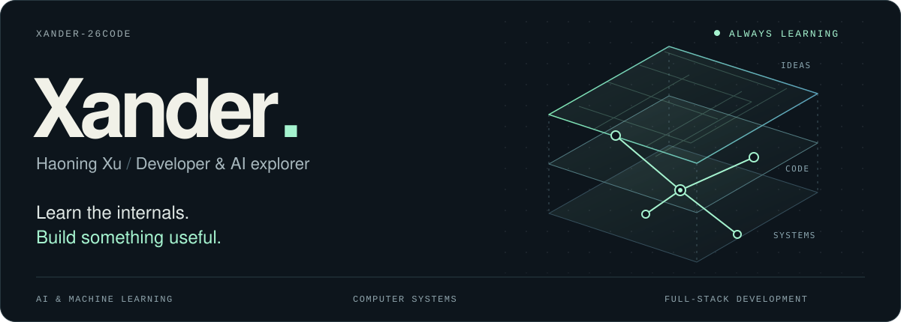
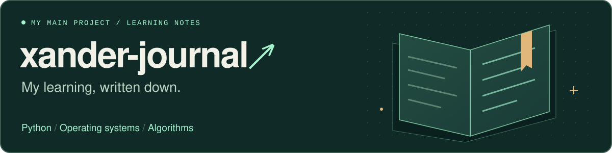

<!-- Keep assets/ with this README. Statistics use the public services credited below. -->
<picture>
  <source media="(max-width: 600px)" srcset="./assets/hero-compact.svg">
  
</picture>

  <a href="#blog">Blog</a>&nbsp; / &nbsp;
  <a href="#my-learning-journal">Learning journal</a> &nbsp; / &nbsp;
  <a href="#github-in-motion">GitHub stats</a> &nbsp; / &nbsp;
  <a href="#things-ive-built">Projects</a> &nbsp; / &nbsp;
  <a href="https://github.com/Xander-26Code?tab=repositories">All repos ↗</a>

### Hi, I'm Haoning Xu. You can call me Xander.

I learn by building things and writing down what I understand. My interests span AI, computer systems, and full-stack development — and **my learning journal is at the heart of it all**.

**把学到的、想明白的、还没想明白的，都记下来。**

 

## My learning journal

<a href="https://github.com/Xander-26Code/xander-journal">
  <picture>
    <source media="(max-width: 600px)" srcset="./assets/journal-compact.svg">
    
  </picture>
</a>

  
  

**[xander-journal](https://github.com/Xander-26Code/xander-journal) is my most important project right now.** It's where I keep my learning notes, code experiments, and explanations: a growing record of what I'm learning and how my understanding changes.

目前主要记录 **Python、操作系统与 Linux、算法练习**。从一个具体问题出发，写下理解，用代码验证，再回来补充。

| Start reading | Inside the notebook |
| :--- | :--- |
| **[Python notes →](https://github.com/Xander-26Code/xander-journal/tree/main/pynotes)** | 程序入口、面向对象、正则表达式、pytest、并发与多线程 |
| **[Operating systems →](https://github.com/Xander-26Code/xander-journal/tree/main/os)** | 操作系统与 Linux 学习笔记、已发布文章的索引 |
| **[Algorithms →](https://github.com/Xander-26Code/xander-journal/tree/main/algo)** | 从双指针开始积累题解与思路 |

 

## GitHub in motion

  
  

  <a href="https://github.com/Xander-26Code">
    <picture>
      <source media="(max-width: 600px)" srcset="https://streak-stats.demolab.com/?user=Xander-26Code&amp;background=0D151C&amp;border=273740&amp;stroke=273740&amp;ring=A5F3CF&amp;fire=A5F3CF&amp;currStreakNum=F1F1E8&amp;sideNums=F1F1E8&amp;currStreakLabel=A5F3CF&amp;sideLabels=C6D4D9&amp;dates=8FA4AC&amp;border_radius=12&amp;disable_animations=true">
      
    </picture>
  </a>

Cards refresh periodically. Language share describes repository code, not proficiency. Powered by <a href="https://github.com/anuraghazra/github-readme-stats">GitHub Readme Stats</a>, <a href="https://github.com/DenverCoder1/github-readme-streak-stats">Streak Stats</a>, and <a href="https://shields.io">Shields.io</a>.

  

## Things I've built

<table>
  <tr>
    <td colspan="2" valign="top">
      
<samp>01 / LEARNING RESOURCE</samp>

      <h3><a href="https://github.com/Xander-26Code/AI-Altas">AI Atlas · AI 全栈学习地图 ↗</a></h3>
      
A Chinese AI learning guide with 27 topics, 6 learning paths, curated resources, and small experiments — from foundations to AI infrastructure.

      
<a href="https://github.com/Xander-26Code/AI-Altas/blob/main/docs/start.md">Start learning →</a> &nbsp; · &nbsp; <a href="https://github.com/Xander-26Code/AI-Altas/blob/main/docs/resources.md">Browse resources</a>

    </td>
  </tr>
  <tr>
    <td width="50%" valign="top">
      
<samp>02 / AI APPLICATION</samp>

      <h3><a href="https://github.com/Xander-26Code/pixel-interviewer">Pixel Interviewer</a></h3>
      
像素面试官

      
A pixel-style interview simulator with résumé analysis, job-description retrieval, follow-up questions, and feedback.

      
<code>Python</code> <code>FastAPI</code> <code>RAG</code>

    </td>
    <td width="50%" valign="top">
      
<samp>03 / DEVELOPER TOOL</samp>

      <h3><a href="https://github.com/Xander-26Code/easyReadme">Easy README</a></h3>
      
让项目更容易被读懂

      
An agent skill that turns repository facts into useful documentation, with reusable patterns and validation scripts.

      
<code>Agent Skills</code> <code>Python</code> <code>Markdown</code>

    </td>
  </tr>
</table>

 

## Always a work in progress

**Exploring** &nbsp; Deep learning · NLP · Computer vision · Computer systems · Full-stack development

**Working with** &nbsp; `Python` · `Java` · `Linux` · `FastAPI` · `HTML / CSS / JavaScript` · `RAG`

The projects show what I've built. **[The journal shows what I'm learning.](https://github.com/Xander-26Code/xander-journal)**

 

---

  <samp>LEARN → BUILD → WRITE → REPEAT</samp>
    
  <a href="https://github.com/Xander-26Code/xander-journal">Read my journal</a> &nbsp; · &nbsp;
  <a href="https://github.com/Xander-26Code">GitHub</a> &nbsp; · &nbsp;
  <a href="https://x.com/mrx819336343086">X / Twitter</a>

