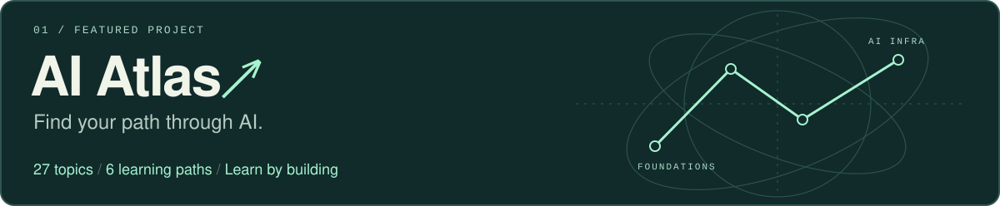

<!-- Keep assets/ with this README: the artwork is local and does not depend on a badge service. -->
<picture>
  <source media="(max-width: 600px)" srcset="./assets/hero-compact.svg">
  
</picture>

  <a href="#selected-work">Selected work</a> &nbsp; / &nbsp;
  <a href="#on-my-desk">On my desk</a> &nbsp; / &nbsp;
  <a href="https://github.com/Xander-26Code?tab=repositories">Repositories ↗</a>

### Hi, I'm Haoning Xu. You can call me Xander.

I'm learning how intelligent systems work, from the models to the software around them. I build AI applications, explore computer systems, and turn what I learn into projects and guides.

**从原理到实现，把学到的东西做出来。**

 

## Selected work

**[AI Atlas · AI 全栈学习地图](https://github.com/Xander-26Code/AI-Altas)**

A Chinese learning guide connecting the foundations, algorithms, applications, and infrastructure of AI. Curated resources, chapter-level reading plans, and small experiments to learn by doing.

[Start here →](https://github.com/Xander-26Code/AI-Altas/blob/main/docs/start.md) &nbsp; · &nbsp; [Choose a path](https://github.com/Xander-26Code/AI-Altas/blob/main/docs/roadmaps/README.md) &nbsp; · &nbsp; [Browse resources](https://github.com/Xander-26Code/AI-Altas/blob/main/docs/resources.md)

 

<table>
  <tr>
    <td width="50%" valign="top">
      
<samp>02 / AI APPLICATION</samp>

      <h3><a href="https://github.com/Xander-26Code/pixel-interviewer">Pixel Interviewer ↗</a></h3>
      
像素面试官

      
A pixel-style interview simulator with résumé analysis, job-description retrieval, follow-up questions, and feedback.

      
<code>Python</code> <code>FastAPI</code> <code>RAG</code>

    </td>
    <td width="50%" valign="top">
      
<samp>03 / DEVELOPER TOOL</samp>

      <h3><a href="https://github.com/Xander-26Code/easyReadme">Easy README ↗</a></h3>
      
让项目更容易被读懂

      
An agent skill that turns repository facts into useful documentation, with reusable patterns and validation scripts.

      
<code>Agent Skills</code> <code>Python</code> <code>Markdown</code>

    </td>
  </tr>
</table>

 

## On my desk

| Direction | What I'm exploring |
| :--- | :--- |
| **Models** | Deep learning, natural language processing, and computer vision. |
| **Systems** | Computer systems and Linux; understanding what runs beneath the application. |
| **Applications** | Full-stack development and practical ways to bring AI into software. |

**My toolkit** &nbsp; `Python` · `Java` · `Linux` · `Machine Learning` · `Deep Learning`

For recent projects, I've also been working with `FastAPI`, `HTML / CSS / JavaScript`, and `RAG`.

 

---

  <samp>LEARN → BUILD → UNDERSTAND → REPEAT</samp>
    
  <a href="https://github.com/Xander-26Code">GitHub</a> &nbsp; · &nbsp;
  <a href="https://x.com/mrx819336343086">X / Twitter</a>

